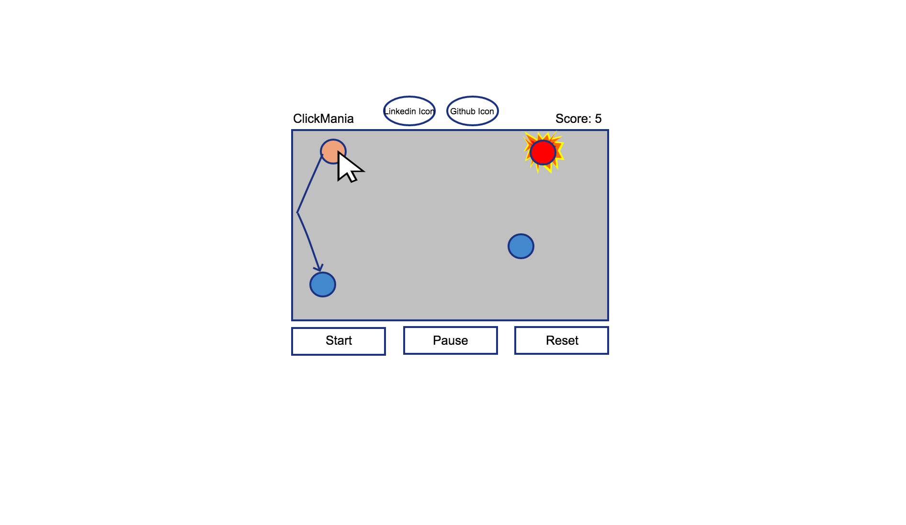

# **Clickmania**

[Live demo](https://elastic-bartik-882c6e.netlify.com/)

## Background and Overview
Clickmania is a simple interactive javascript game. The objective of the game is to click on the circles and increase your score before the circle expires. Each time a circle is successfully clicked, the circle multiplies and branches off in random directions at random distances. As the game progresses the circle will increase more.

## Technologies
This project will be implemented using the following technologies:

* Vanilla Javascript for overall sture and game logic
* `HTML5 Canvas` for DOM manipulation and rendering
* `Howler.js` for audio/sounds
* Webpack to bundle and serve up the various scripts

There will be a few scripts involved for this project:

`board.js`: responsible for handling the logic for creating and updating the necessary DOM elements

`circle.js`: responsible for handling the logic of the circle

`animation.js`: responsibile for generating the physics of the circle when clicked, the animations that come after

`audio.js` : responsible for the audio logic

## Functionality & MVP
In Clickmania, the user should be able to:

- [ ]  Start the game
- [ ]  Click on the circles to score points
- [ ]  View current score

### Circle Multiplying
- [ ]  Circle disappears once clicked and makes a sound
- [ ]  At minimum two new circles are generated with animations
- [ ]  Trajectory animations will be varied in direction and velocity 
- [ ]  Trajectory of the new circles that hits out of bounds should treat the border as a wall and bounce appropriately.
- [ ]  Make circles turn colors to indiciate status of the circle.

### Bonus Features
In the future, I would like to add:

- [ ]  Accuracy of the clicker
- [ ]  Add easier/harder difficulty. Making the circles become smaller and smaller

## Wireframe
The app will consist of a single screen with the simulation canvas with my github and linkedin images. 

The circles will generate a new circle when clicked.

There will be controls to change the state of the game.

## Implementation Timeline
Day 1:
- [ ]  Review Astroids project
- [ ]  Review Tutorials on Canvas and Howler.js

Day 2: Setup Node modules and get webpack up and running. Create `webpack.config.js` and `package.json`. Setup skeleton of the 4 scripts alongside with entry file. Goals of the day:
- [ ]  Have webpack functional
- [ ]  Learn enough to have sounds and a Canvas element
- [ ]  Use Astroids project as a baseline, alongside with any relevant logic/physics to move a circle correctly

Day 3: Figure out `Howler.js`. Get the Board object to have sounds properly working. Goals of the day:
- [ ]  Complete `circle.js` module
- [ ]  Get sounds to play on click, respawns, start, gameover
- [ ]  Get animation for respawns working
- [ ]  Be able to destroy `Circle` via `onClick`

Day 4: Create the logic backend.
- [ ]  Functional screen on `Canvas` frontend that correctly handles creation and running of the simulation
- [ ]  Ensure starting, stopping, and resetting works.

Day 5: Have controls to make the game interactive and easy to use. Style the frontend, making it polished and professional.
- [ ]  Create controls for game to stop, start, restart
- [ ]  Have styled `Canvas`

Over the weekend:
- [ ]  Test the project for bugs
- [ ]  Deplay the project on GitHub